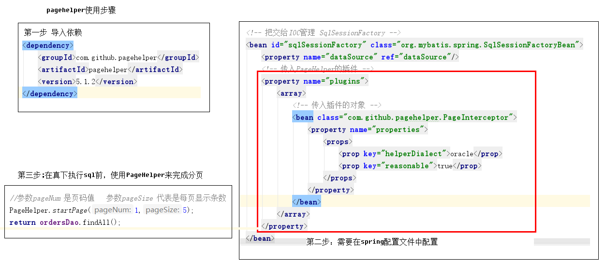
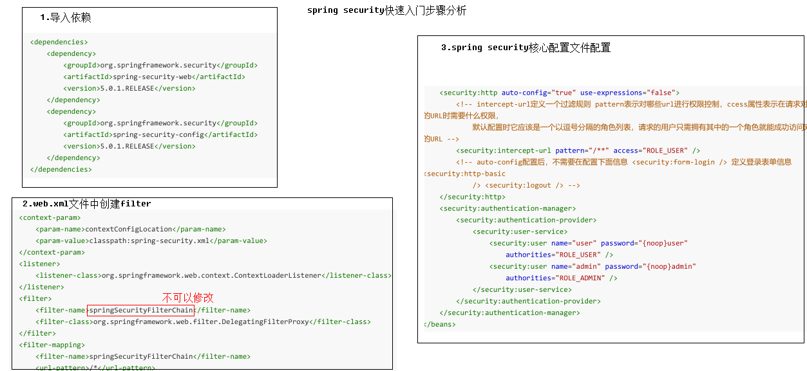
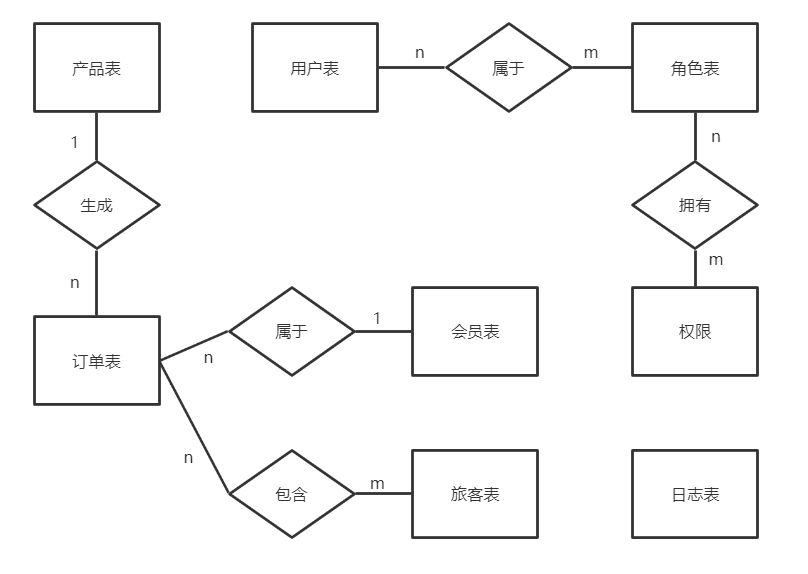

### 旅游项目后台管理系统

​	Maven搭建项目，后台采用SSM框架，数据库采用Oracle，前端采用Admin-LTE快速搭建页面，模板引擎采用JSP。主要目的：

- 熟悉项目流程，SSM整合
- 模块化思想实践（通过物理方式：Maven）
- Oracle实践，练习mybatis多表操作
- 将Spring AOP用于实战（访问日志记录）
- 熟悉Spring Security的基本使用（实现权限管理）
- PageHelper分页插件的使用

#### 功能介绍

##### 商品查询

- 查找所有商品
- 商品添加

（Date类型转换问题）

​	传统方式：自定义Converter，在配置文件中配置bean。

​	使用@DateTimeFormat(pattern = "yyyy-MM-dd")注解bean中成员变量

##### 订单管理

- 查询所有订单（关联产品信息）

（PageHelper分页）



- 订单详情查询

（多表查询：订单与产品多对一；订单与旅客多对多；订单与会员多对一）

##### 用户管理

Spring Security的使用



- 查询所有用户
- 用户添加 （密码编解码问题）
- 查询用户详情（角色，权限关联查）

##### 角色管理

- 角色查询所有
- 角色添加
- 角色查询详情
- 角色删除（删除用户角色关联表，删除角色权限关联表，最后删除角色）

##### 资源权限管理

- 资源权限查询
- 资源权限添加
- 资源权限详情
- 资源权限删除

##### 关联表的操作

- 用户关联角色

- 角色关联权限

  以角色关联权限举例：先查角色所没有的权限展示，再操作关联表。

  注意多个dao中的方法，多个参数时，@Param指定绑定的参数名称

##### 权限控制

（方法级权限控制）JSR250，SPEL表达式，支持表达式

（页面上的权限控制）获得当前用户信息；指定显示某些内容

这里两个用户：tom@tom 和 jay@jay

​	tom只有user权限

​	jay有user和admin权限

​	用户管理只有拥有ADMIN权限的用户能看到

##### AOP日志

#### Oracle数据库设计

##### 具体表（省略中间表）

###### 	E-R图



##### 表结构

​	数据库见schema.sql

```sql
--产品表
CREATE TABLE product(
id varchar2(32) default SYS_GUID() PRIMARY KEY,
productNum VARCHAR2(50) NOT NULL,
productName VARCHAR2(50),
cityName VARCHAR2(50),
DepartureTime timestamp,
productPrice Number,
productDesc VARCHAR2(500),
productStatus INT,
CONSTRAINT product UNIQUE (id, productNum)
) 

-- 会员
CREATE TABLE member(
       id varchar2(32) default SYS_GUID() PRIMARY KEY,
       NAME VARCHAR2(20),
       nickname VARCHAR2(20),
       phoneNum VARCHAR2(20),
       email VARCHAR2(20) 
);

-- 旅客
CREATE TABLE traveller(
  id varchar2(32) default SYS_GUID() PRIMARY KEY,
  NAME VARCHAR2(20),
  sex VARCHAR2(20),
  phoneNum VARCHAR2(20),
  credentialsType INT,
  credentialsNum VARCHAR2(50),
  travellerType INT
)
-- 订单
CREATE TABLE orders(
  id varchar2(32) default SYS_GUID() PRIMARY KEY,
  orderNum VARCHAR2(20) NOT NULL UNIQUE,
  orderTime timestamp,
  peopleCount INT,
  orderDesc VARCHAR2(500),
  payType INT,
  orderStatus INT,
  productId varchar2(32),
  memberId varchar2(32),
  FOREIGN KEY (productId) REFERENCES product(id),
  FOREIGN KEY (memberId) REFERENCES member(id)
)

-- 订单与旅客中间表
CREATE TABLE order_traveller(
  orderId varchar2(32),
  travellerId varchar2(32),
  PRIMARY KEY (orderId,travellerId),
  FOREIGN KEY (orderId) REFERENCES orders(id),
  FOREIGN KEY (travellerId) REFERENCES traveller(id)
)


-- 用户表
CREATE TABLE users(
id varchar2(32) default SYS_GUID() PRIMARY KEY,
email VARCHAR2(50) UNIQUE NOT NULL,
username VARCHAR2(50),
PASSWORD VARCHAR2(100),
phoneNum VARCHAR2(20),
STATUS INT
)

-- 角色表
CREATE TABLE role(
id varchar2(32) default SYS_GUID() PRIMARY KEY,
roleName VARCHAR2(50) ,
roleDesc VARCHAR2(50)
)


-- 用户角色关联表
CREATE TABLE users_role(
userId varchar2(32),
roleId varchar2(32),
PRIMARY KEY(userId,roleId),
FOREIGN KEY (userId) REFERENCES users(id),
FOREIGN KEY (roleId) REFERENCES role(id)
)

-- 资源权限表
CREATE TABLE permission(
id varchar2(32) default SYS_GUID() PRIMARY KEY,
permissionName VARCHAR2(50) ,
url VARCHAR2(50)
)

-- 角色权限关联表
CREATE TABLE role_permission(
permissionId varchar2(32),
roleId varchar2(32),
PRIMARY KEY(permissionId,roleId),
FOREIGN KEY (permissionId) REFERENCES permission(id),
FOREIGN KEY (roleId) REFERENCES role(id)
)


--日志表
CREATE TABLE sysLog(
id VARCHAR2(32) default SYS_GUID() PRIMARY KEY,
visitTime timestamp,
username VARCHAR2(50),
ip VARCHAR2(30),
url VARCHAR2(50),
executionTime int,
method VARCHAR2(200)
)

```

#### 结尾

- JSP中BUG还很多未改
- 功能易扩展，自行拓展功能练手